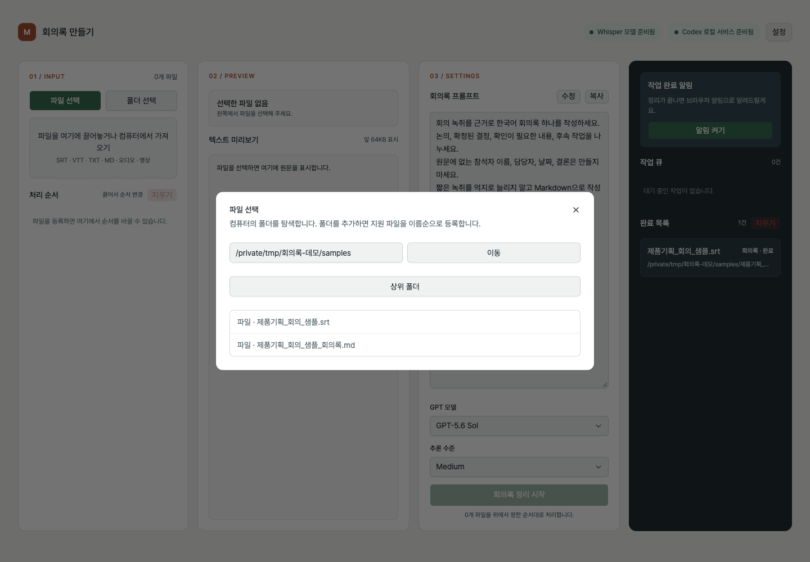
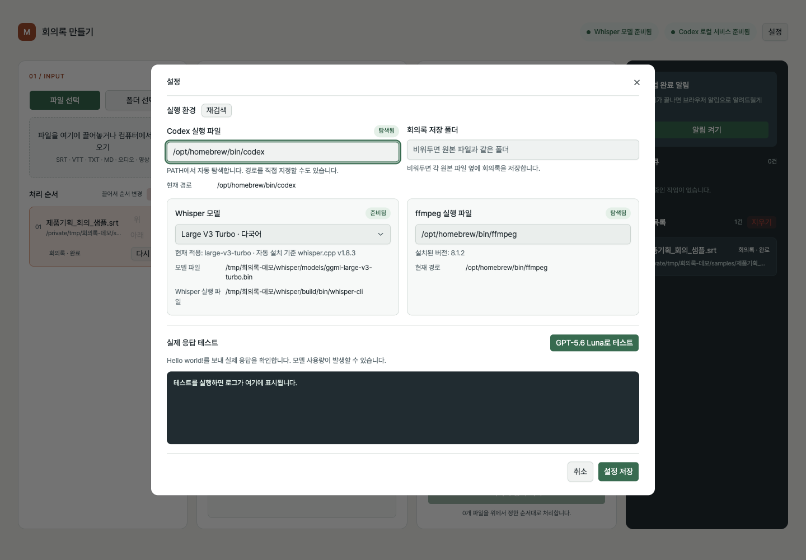
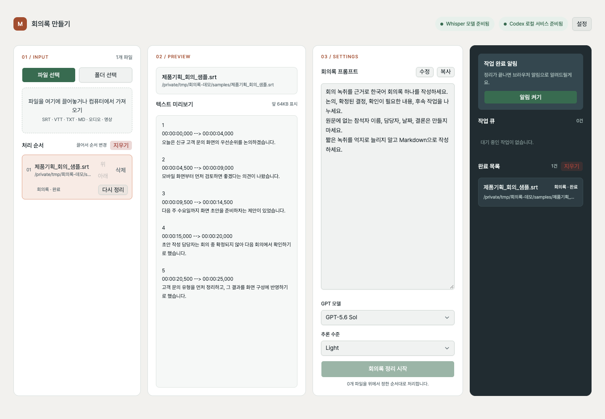
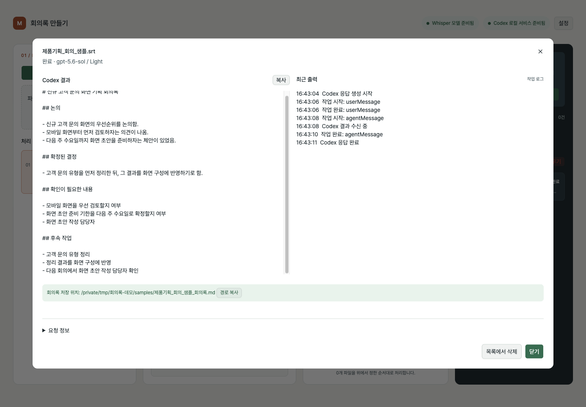
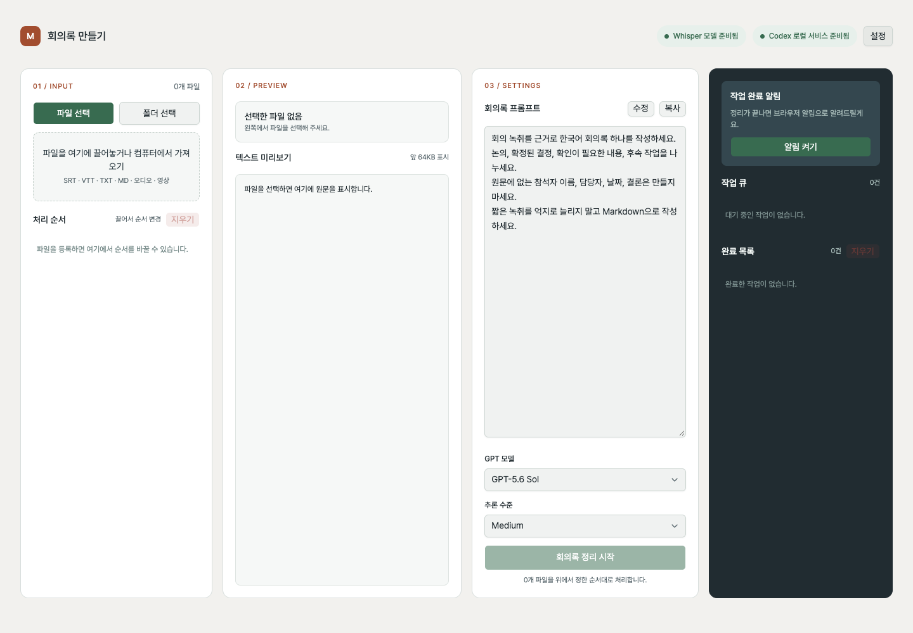

# Meet to MD

로컬 자막·텍스트·오디오 파일을 한 파일당 하나의 Markdown 회의록으로 만드는 웹서비스입니다. Go chi 서버가 파일과 작업 큐를 관리하고, Svelte/Vite UI가 진행 상태를 실시간으로 표시합니다. 회의록 본문은 로컬 Codex app-server가 생성합니다.

## 화면 미리보기

가상의 SRT 샘플을 넣어 실행한 화면입니다. 파일 선택부터 전사 설정, 회의록 저장까지 살펴볼 수 있습니다. 실제 회의 녹음이나 개인정보는 사용하지 않았습니다.

| 파일 선택과 작업 목록 | SRT 미리보기와 작업 설정 |
| --- | --- |
|  |  |
| 로컬 실행 환경 확인 | 회의록 생성 완료 |
|  |  |
| 생성된 문서와 작업 로그 | 앱의 첫 화면 |
|  |  |

## 준비

- Go 1.23 이상, Node.js 22 이상
- 로그인된 최신 Codex CLI (`codex app-server` 지원). `codex --version`으로 확인합니다. Codex 데스크톱 앱만으로 CLI 경로가 항상 제공되지는 않으므로, 앱이 찾지 못하면 설정에서 CLI 실행 파일의 절대경로를 지정하세요.
- 오디오·영상 전사를 쓰려면 `ffmpeg`가 필요합니다. macOS에서 Whisper 설치 버튼으로 실행 파일을 빌드하려면 CMake도 필요합니다. Windows x64/ARM64에서는 공식 whisper.cpp 바이너리를 내려받습니다.

## 실행

```bash
cd ui
npm install
npm run build

cd ../server
go run .
```

브라우저에서 `http://127.0.0.1:8791`을 엽니다. 개발 중에는 서버를 실행한 상태에서 다른 터미널로 `cd ui && npm run dev`를 사용합니다. Vite는 `/api`를 Go 서버로 전달합니다.

Windows PowerShell에서도 각 폴더로 이동해 같은 `npm`/`go` 명령을 실행합니다. 경로는 운영체제의 경로 처리 함수를 통해 다룹니다. 외부 기기에서 접근하도록 서버를 열지 않습니다.

## 사용

1. `파일 선택` 또는 `폴더 선택`으로 로컬 파일을 탐색합니다. 여러 파일을 끌어놓거나 `컴퓨터에서 가져오기`를 선택해도 됩니다.
2. 처리 목록에서 파일을 클릭하면 미리보기가 보입니다. 목록은 끌어서 이동하거나 위·아래 버튼으로 순서를 바꿉니다.
3. 오디오·영상 파일은 `전사 시작`을 눌러 전사문을 먼저 확인할 수 있습니다. FFmpeg·Whisper 상태와 로그가 미리보기 아래에 표시됩니다. 실행 중인 전사는 작업 상세에서 취소할 수 있습니다.
4. 프롬프트, 모델, 추론 수준을 확인한 뒤 `회의록 정리 시작`을 누릅니다. 확인 대화상자에서 승인해야 대기열에 들어갑니다. 미리 전사하지 않은 미디어는 이때 자동으로 전사합니다.
   작업을 시작해도 처리 목록과 선택한 미리보기는 유지됩니다. 대기·진행 중인 파일은 중복 등록하지 않으며, 완료한 파일은 해당 행의 `다시 정리`로 재실행할 수 있습니다. `처리 순서 > 지우기`는 입력 목록만 비우고, 실행 중인 작업과 실제 파일은 보존합니다. 긴 텍스트는 높이가 제한된 미리보기 안에서 스크롤합니다.
5. 오른쪽의 작업 큐나 완료 목록을 눌러 전사문·Whisper 로그 또는 Codex 결과·최근 출력을 봅니다. 영상 작업에서는 SRT와 회의록의 저장 경로를 각각 복사할 수 있습니다.

로컬 탐색으로 고른 원본은 기본적으로 **그 원본과 같은 폴더**에 `<원본 이름>_회의록.md`로 저장합니다. 영상(`.mp4`, `.mov`) 회의록 작업은 Whisper 전사가 끝나면 같은 폴더에 `<원본 이름>_전사.srt`도 저장합니다. 기존 결과가 있으면 SRT와 MD에 같은 번호(`_2`, `_3` 등)를 붙여 보존합니다. 회의록 작성이 실패하거나 취소되어도 이미 저장된 SRT는 남습니다. 브라우저 파일 가져오기/끌어놓기는 원본 경로를 알 수 없으므로 프로젝트의 `inbox/`에 복사하고 그 폴더에 결과를 저장합니다.

지원 텍스트: `.srt`, `.vtt`, `.txt`, `.md`. 지원 미디어: `.wav`, `.mp3`, `.m4a`, `.mp4`, `.mov`, `.ogg`. 미디어 전사문은 타임코드가 있는 SRT 형식으로 `server/data/transcripts/`에 보관됩니다. 같은 원본과 Whisper 모델로 회의록을 만들 때 재사용하며, 원본 파일이나 모델이 바뀌면 다시 전사합니다. 결과 폴더로의 SRT 자동 저장은 영상 회의록 작업에 적용됩니다. 이 SRT는 영상 내 자막 트랙이 아니라 Whisper가 음성에서 만든 전사문입니다.

전사 캐시를 비우려면 앱을 종료한 뒤 `server/data/transcripts/`의 파일을 삭제하세요. 다음 미디어 작업에서 필요한 전사문을 다시 만듭니다.

## 설정

`server/config.toml`은 `server/main.go`와 같은 폴더에 있습니다. UI의 설정에서도 수정할 수 있습니다.

| 항목 | 의미 |
| --- | --- |
| `prompt` | 파일 하나에서 회의록 Markdown 하나를 만드는 지시문 |
| `codex_binary` | Codex CLI 명령 또는 실행 파일 절대경로. 기본 `codex` |
| `output_dir` | 비우면 입력 파일과 같은 폴더 |
| `whisper_model` | 기본값 `large-v3-turbo`(약 1.5GiB). `base`, `small`도 선택 가능 |
| `ffmpeg_binary` | ffmpeg 명령 또는 실행 파일 경로 |

`설정 > 실제 응답 테스트`는 `gpt-5.6-luna`에 `Hello world!`를 보내므로 모델 사용량이 발생할 수 있습니다. Whisper 설치 버튼은 모델을 `whisper/models/`에 받고 실행 파일을 `whisper/` 안에 준비합니다. 설치 중에는 설정 화면에서 단계·다운로드 전송량·실시간 로그를 확인할 수 있고 서버 터미널에도 단계와 로그가 출력됩니다. 다운로드 크기를 알 수 있을 때만 퍼센트가 표시됩니다. 모델은 Hugging Face의 whisper.cpp 배포본, 실행 파일/소스는 [공식 whisper.cpp](https://github.com/ggml-org/whisper.cpp)를 사용합니다.

모델 선택지는 GPT-6 Astra, GPT-6 Sol, GPT-5.6 Sol입니다. 각 모델에 Light(`low`), Medium(`medium`), High(`high`), Extra high(`xhigh`)를 전달합니다. 실행 중인 Codex CLI의 `model/list`에 없는 모델은 UI에서 선택할 수 없게 표시합니다. Codex CLI와 계정에 따라 사용 가능한 모델이 달라집니다.

## 작업과 데이터

큐는 전사와 회의록 작업을 한 번에 하나씩 실행합니다. `server/data/jobs.json`에 상태를 저장하고, 서버 재시작 시 대기 작업은 이어서 실행합니다. 실행 중이던 작업은 중단 상태로 표시합니다. UI 상태는 Server-Sent Events로 전달됩니다. 취소하면 실행 중인 FFmpeg, Whisper 또는 Codex 프로세스를 종료합니다.

서버는 `127.0.0.1`에만 바인딩하며, 변경 요청에 로컬 요청 헤더와 Origin 검사를 요구합니다. 파일 내용은 Codex 요청에 포함되므로 선택한 Codex 계정/서비스의 데이터 처리 정책이 적용됩니다. 앱은 입력 파일을 직접 수정하지 않습니다.

## 라이선스

이 저장소의 프로젝트 코드는 [MIT License](LICENSE)로 제공됩니다. 상업적 사용, 복사, 수정, 배포, 재라이선스 및 판매가 가능하며, 소프트웨어나 상당 부분을 다시 배포할 때는 저작권 고지와 MIT 라이선스 전문을 함께 포함해야 합니다.

저장소에 포함되거나 앱에서 내려받는 서드파티 라이브러리, 폰트, 실행 파일, AI 모델에는 각자의 라이선스와 이용 조건이 적용됩니다. 예를 들어 Pretendard 폰트는 [별도 OFL 라이선스](ui/public/PRETENDARD-LICENSE.txt)를 따릅니다.

## 개발 검증

```bash
cd server && go test -race ./...
cd ui && npm test && npm run check && npm run build
```

모델 식별자 확인은 `cd server && go run ./cmd/modelprobe -list`로 할 수 있습니다. 실제 모델 응답은 `go run ./cmd/modelprobe -model gpt-6-sol -effort low`로 확인합니다.

자세한 구현 경계와 검증 범위는 [ARCHITECTURE.md](ARCHITECTURE.md), [QUALITY.md](QUALITY.md)에 적었습니다.

UI 코드를 정렬하려면 `cd ui && npm run format`, 정렬 여부만 확인하려면 `npm run format:check`를 실행합니다.
